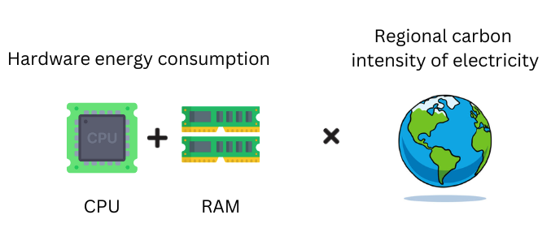

# Summary

Node.js is a popular JavaScript runtime environment that is widely used for web development and server-side applications. However, the environmental impact of Node.js processes is often overlooked. Node-carbon is a tool that can be used to measure the carbon footprint of Node.js processes. It does this by estimating the electricity consumption of the hardware used to run the processes and then applying the carbon intensity of the region where the processes are running.

# Statement of need

The increasing popularity of Node.js [@w3techs_usage_2022] for web development and server-side applications has raised concerns about the environmental impact of computational processes [@szczesny_reduce_2021]. While existing tools like [CO2.js](https://developers.thegreenwebfoundation.org/co2js/overview/), [EcoPing](https://ecoping.earth), and [Website Carbon Calculator](https://www.websitecarbon.com/) provide valuable insights into the carbon footprint of web applications, they primarily focus on factors like grid energy mix, process execution time, system boundaries [@greenwood_why_2020] and data transfer, lacking a comprehensive approach that incorporates hardware power usage. This limitation can lead to inaccurate carbon footprint assessments and hinder developers' efforts to minimize their environmental impact.

To address this gap, there is a need for a more comprehensive tool like Node Carbon that directly measures hardware power consumption (RAM + CPU) and incorporates it into its carbon footprint calculations.

{width="100%"}

Figure 1 describes the general process of calculating carbon emission. This enhanced approach would provide developers with more accurate and actionable insights, enabling them to:

- Optimize their code to reduce energy consumption
- Select more efficient hardware components
- Choose hosting providers that utilize renewable energy sources

By accurately quantifying the carbon footprint of Node.js applications, Node Carbon empowers developers to make informed decisions that contribute to a more sustainable digital ecosystem.

# References